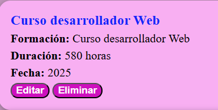
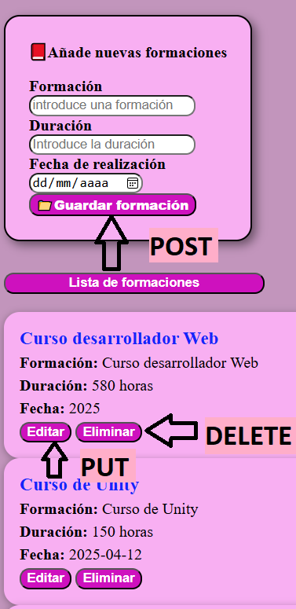
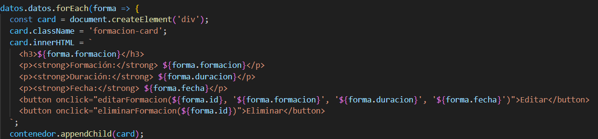
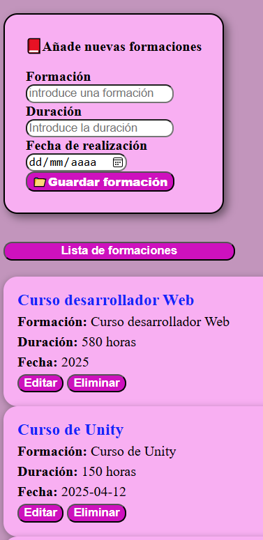

# CRUD CURRICULUM 
***
Gestor de formaciones con Node.js, Express y JSON

## Introducción

Este proyecto es el primero en el que pongo en práctica la unión entre el frontend y el backend, poniendo en práctica así, por primera vez, los conocimientos obtenidos para llegar a ser un desarrollador Full Stack. 

# 1.¿Qué hace este CRUD?

Permite leer, crear, editar y borrar un listado de formaciones donde puedes indicar donde la realizaste, fecha y duración de ésta. 

# 2.¿Cuál es el objetivo de este ejercicio?

Con este ejercicio quería comprender como funcionan las conexiones entre el frontend y el backend usando Express. También el uso de los archivos JSON, como éstos pasan por el servidor y se transforman para ser leidos y usados. 

Aquí también vemos como funciona la gestión de rutas, las peticiones del frontend, el uso de try...catch.

Aproveché este proyecto para comprender como crear y modificar etiquetas HTML y texto desde JavaScript.

# 3.¿Qué conceptos técnicos pone en práctica? 

Este proyecto sirvió para implementar un CRUD (Create, Read, Update, Delete) y ver como son y funcionan las peticiones HTTP (GET,POST,PUT,DELETE) desde Express, donde pude observar como Express simplifica y agiliza las funcionalidades de Node.js.

En el frontend aprendí la manipulación del HTML mediante JavaScript, donde mediante la petición GET le indicamos que genere tarjetas nuevas por cada dato guardado en el JSON. Como se puede ver en la imagen, generamos una estructura dinámica HTML que se cargará en el DOM cada vez que creemos un dato nuevo en el archivo JSON. 

También puse en práctica el control de errores, aunque, sobretodo visible en la consola, tanto del servidor como en el navegador; validaciones básicas; middleware como cors() y express.json() que permiten la comunicación entre frontend y backend, donde cors() permite la conexión entre puertos de ambos lados y express.json() permite la lectura y escritura en estos archivos, los json.

# 4.¿Qué nuevas herramientas he usado?

En este proyecto podemos encontrar en el backend a Node.js, Express, ambos basados en JavaScript y archivos json y en el frontend tenemos JavaScript, CSS y HTML. 

Implementé Fecht API para peticiones asíncronas, CORS para las comunicaciones entre frontend y backend, Nodemon para agilizar el desarrollo con el refresco autómatico. 

# 5.Ejecución del proyecto

1.- Para poder ejectuar el proyecto será necesario tener instalados previamente las siguientes herramientas: 

    -> Visual Studio Code: Version 1.105.1
        ->Extensiones necesarias: 
            -> Code Runner: Version 0.12.2
            -> Live Server: Version 5.7.9
            -> HTML CSS Support Version 2.0.13
            -> GIT: Version 2.51.0
    -> Node.js: Version 22.19.0
        -> Express: Version 5.1.0
    -> Navegador actualizado (Chromme, Edge, Firefox)

2.- Instalación de dependencias: 
    -> npm install

3.- Iniciar el servidor: 
    -> npm run dev

    Se monstrará en http://localhost:3000

4.- Abrir el frontend

    ->Usa Live Server

Una vez realizado esto debería funcionar correctamente todas las funcionalidades del CRUD. 

# 6.Aprendizaje progresivo

Durante el desarrollo de este proyecto he podido averiguar y comprender como JavaScript es mucho más que funciones, arrays, condicionales y variables. Comprendí que las funcionalidades creadas por Node.js y las abreviaturas de Express son vitales para la verdadera usabilidad de una página web y la permanencia de datos. 

Aprendí la importancia de los archivos json y su función. Incluso compredí el peligro que puede suponer introducir datos json sin cifrar, en el caso de contraseñas y otros datos sensibles a los que cualquiera podría acceder si la configuración no es la correcta. 

Algo que me costó mucho comprender fue el uso del mismo formulario para guardar datos nuevos "POST" y para guardar las ediciones "PUT" usando el mismo campo y botón para hacer peticiones al servidor. Esto me llevó al error de pernsar que sería imposible explicar por código que esta función para que funcionara correctamente. 

# 7.Tecnologías usadas

1.- Frontend: 
    -> HTML5
    -> CSS3
    -> JavaScript

2.- Backend
    -> Node.js
    -> Express

# 8.Estructura del proyecto

CRUD-Curriculum

|-- backend/                # Lógica del servidor y gestió de datos
    |-- node_modules/       # Dependencias instaladas con npm
    |-- curriculum.json     # "Base de datos" local con las formaciones   
    |-- package.json        # Configuración del proyecto Node
    |-- package-lock.json   # Registro exacto de versiones instaladas
    |-- server.js           # Servidor Express: Rutas, peticiones y respuestas
|
|-- frontend/               # Interfaz de usuario
    |-- index.html          # Página principal y estructura del contenido
    |-- script.js           # Lógica del cliente: Peticiones Fetch y manejo del DOM
    |-- styles.css          # Estilos y diseño visual del proyecto
|
|-- README.md               # Documentación principal del proyecto

📁backend/
Contiene el servidor de Node.js y Express, responsables de procesar las peticiones, y los archivos json. que incluyen "package.json" y "package.json" que son de configuaracion y el archivo "curriculum.json" donde se encuentran los datos de las formaciones. 

📁frontend/
Incluye los archivos "index.html" que es la estructura de la web; el archivo "styles.css" que da la imagen y maquetación de la página; y "scritp.js" donde damos la funcionalidad, la conexión con el servidor y el usuario activa las peticiones al servidor desde Fetch. 

📄README.md
Este mismo archivo. El archivo de documentación donde describimos el proyecto completo, funcionalidades, tecnologías, aprendizajes, etc.

# 9.Mejoras para el futuro

Me gustaría probar a conectar varios archivos json, si esto es posible, para poder generar, a parte de la formación, la experiencia. Una vez consiga esto, me gustaría que con todos los datos introducidos puedas generar un pdf con uno o varios estilos, a elegir, con tu curriculum. 

Además, me gustaría poder conectarlo a una base de datos, la cual estudiaremos en breve, como es MongoDB, para luego implementar auteticación por usuario. De esta forma conseguir que cada uno pueda acceder a sus propios datos, donde sean privados y modificables. 

También me gustaría mejorar algo el CSS y darle un estilo más moderno y visual, que ayude también a la accesibilidad. 

Quizás también podría añadir avisos visuales o sonoros para indicar si los archivos se generaron correctamente. 

# 10.Conclusión 

Con este proyecto aprendí mucho sobre las conexiones entre frontend y backend, las url, las peticiones (GET,POST,PUT,DELETE), la estructuración de un proyecto Full Stack, la creación de etiquetas HTML dinámicas desde JavaScript anidada con una respuesta del servidor. 

Es muy interesante comprender como funciona la permanecia de los datos, la diferencia de ejecutar un proyecto con memoria local y este, donde los datos de guardan permanentemente en el archivo json. Las conversiones necesarias de formatos que realiza el servidor y script para poder leer, escribir, modificar y borrar cualquier dato. 

Espero poder seguir desarrollandome dentro del desarrollo web Full Stack para llevar a cabo proyectos que ya tengo en mente y por la satisfacción de saber que puedo crearlos y ejecutarlos. 

Sabiendo que vengo de un sector completamente extraño y ajeno al desarrollo web, como es el control de plagas, me parece un trabajo muy interesante donde crear o modificar cualquier proyecto para que funcione como quieres o querría un cliente. Es gratificante. 